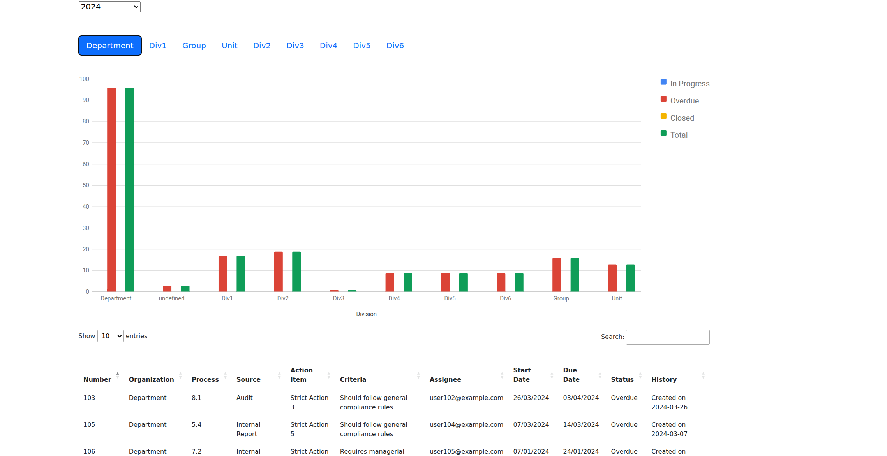

# 📊 Action Item Summary Report


> 🚀 A web-based dashboard application for tracking and visualizing action items across different organizational divisions with interactive data tables and charts.

## 🎯 Overview

Enterprise dashboard for managing action items across multiple organizational divisions. Features real-time data visualization, interactive filtering, and comprehensive reporting capabilities.

## 📸 Dashboard Preview



*Interactive dashboard showing action item tracking with data tables and visualization charts*

## ✨ Features

- 📅 **Year-based Filtering** - Filter data by specific years or view all years
- 🏢 **Division Views** - Organize data by Department, Divisions, Group, and Unit
- 📋 **Interactive Tables** - Sortable and searchable data tables
- 📈 **Data Visualization** - Bar charts showing action item status
- 📊 **Excel Integration** - Automatic Excel file processing
- 📱 **Responsive Design** - Mobile-friendly interface

## 🛠️ Technical Implementation

**Technologies Used:**
- HTML5, CSS3, JavaScript (ES6+)
- Bootstrap 5, jQuery 3.6.1
- SheetJS (XLSX), Google Charts API, DataTables

**Key Capabilities:**
- Real-time data processing and visualization
- Complex business logic implementation
- Responsive UI/UX design
- Performance-optimized data handling

## 📁 Project Structure

```
📦 project-01-Data Chart/
├── 🏠 index.html          # Main application page
├── ⚙️ script.js           # Core JavaScript functionality  
├── 🎨 style.css           # Custom styles
├── 📂 css/                # UI frameworks
├── 📂 js/                 # JavaScript libraries
├── 📂 data/               # Excel data files
└── 📂 img/                # Assets
```

---

<!-- Development Timeline: Project completed Nov 2022 -->

<div align="center">

**Enterprise Action Item Management Dashboard**

*Built for organizational efficiency and data-driven decision making*

</div>