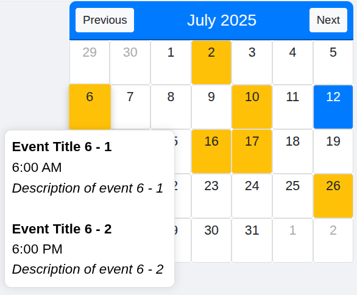

# 📅 SharePoint Events Calendar


> 🚀 A responsive web calendar application with SharePoint integration for displaying and managing organizational events with interactive hover tooltips.

## 🎯 Overview

Interactive calendar widget designed for enterprise environments with SharePoint integration. Features event display, month navigation, and hover-based event details for seamless organizational event management.

## 📸 Preview



## ✨ Features

- 📅 **Month Navigation** - Navigate between months with Previous/Next buttons
- 🏢 **SharePoint Integration** - Fetch events from SharePoint REST API
- 📋 **Event Tooltips** - Hover over days to see event details
- 📊 **Demo Events** - Sample events for demonstration purposes
- 📱 **Responsive Design** - Mobile-friendly calendar grid
- 🎨 **Visual Indicators** - Highlighted current day and event days

## 🛠️ Technical Implementation

**Technologies Used:**
- HTML5, CSS3, JavaScript (ES6+)
- Bootstrap 4.5.2, jQuery 3.5.1
- SharePoint REST API integration

**Key Capabilities:**
- CSS Grid layout for calendar structure
- AJAX calls for SharePoint data fetching
- Dynamic event rendering with hover effects
- Responsive square grid cells
- Error handling for API failures

## 📁 Project Structure

```
📦 project-02-EventsCalander/
├── 📅 EventsCalender.html     # Main calendar application
├── ⚙️ script.js              # Calendar functionality
└── 📖 README.md              # Project documentation
```

## 🔧 Setup & Configuration

1. **SharePoint Setup**: Update the SharePoint site URL in the `fetchEvents` function
2. **Event List**: Ensure SharePoint list named 'Events' exists with required fields
3. **Authentication**: Configure SharePoint authentication as needed
4. **Customization**: Modify colors, layout, or event display format

## 📋 SharePoint List Requirements

Required fields in SharePoint 'Events' list:
- **Title** (Text) - Event name
- **Description** (Text) - Event description  
- **EventDate** (Date/Time) - Event date and time
- **Month** (Number) - Event month
- **Year** (Number) - Event year

---


<div align="center">

**Enterprise Events Calendar Widget**

*Built for organizational event management and team coordination*

<!-- Development Timeline: Project completed July 2024 -->
</div>