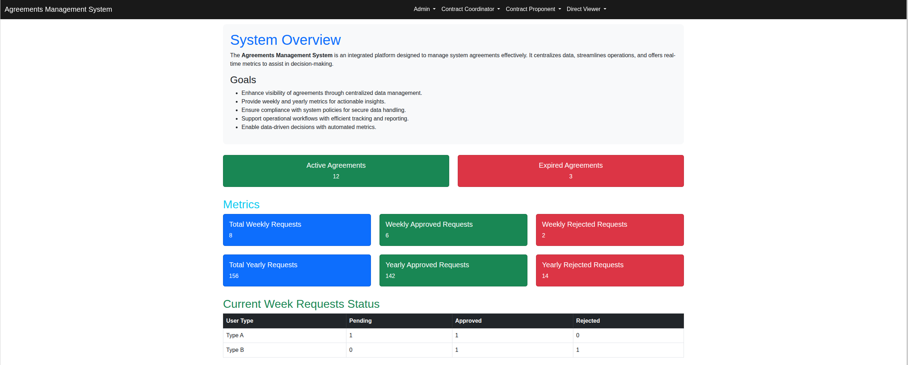

# 📊 Agreements Management System


> 🤝 An integrated platform designed to manage agreements between organizations and third-party entities with real-time metrics and operational workflow support.

## 🎯 Overview

Web-based management system for business agreements with real-time analytics and reporting capabilities. Features comprehensive tracking and role-based access control for efficient workflow management.

## 📸 Application Preview



*Comprehensive system interface with agreement tracking, metrics visualization, and request management*

## ✨ Core Features

- 📅 **Agreement Management** - Track active and expired agreements
- 📊 **Real-time Metrics** - Weekly and yearly statistics dashboard
- 🔐 **Role-based Access** - Admin, Contract Coordinator, Proponent, and Viewer roles
- 📋 **Request Tracking** - Type A vs Type B request status monitoring
- 🎨 **Dynamic Navigation** - Scroll-responsive navbar with visual transitions
- 📱 **Responsive Design** - Mobile-friendly Bootstrap 5 interface

## 🚀 SharePoint Integration

Integrated with SharePoint API to fetch agreement data, request statuses, and metrics from multiple lists including Agreements, Type A Requests, and Type B Requests with automated data processing and visualization.

## 🛠️ Technical Stack

**Frontend Technologies:**
- HTML5, CSS3, JavaScript (ES6+)
- Bootstrap 5.3.1
- Responsive grid system

**Backend Integration:**
- SharePoint REST API
- Multi-list data aggregation
- Role-based data filtering

**Key Capabilities:**
- Real-time data synchronization
- Dynamic status calculations
- Week/year-based metrics computation
- Cross-list data correlation

## 📁 Project Structure

```
📦 project-04-3rdAgr/
├── 🏠 3rd dashbouard.html   # Main system application
├── ⚙️ script.js            # JavaScript logic and functionality
├── 📂 img/                 # Assets and preview files
│   └── system-preview.png  # Application preview
└── 📋 README.md            # Documentation
```

---

<!-- Development Timeline: Project completed November 2024 -->

<div align="center">

**Business Third-Party Agreement Management Platform**

*Built for system efficiency and compliance-driven decision making*

</div>