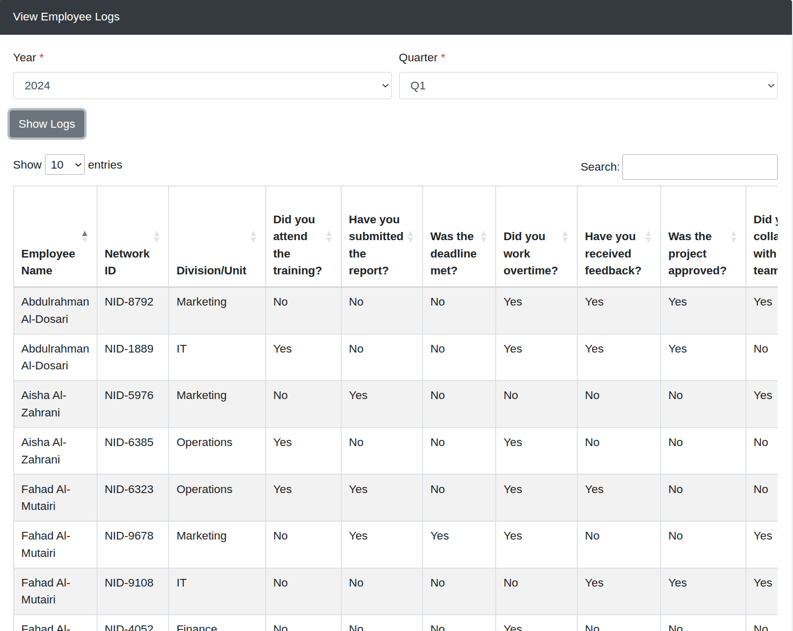
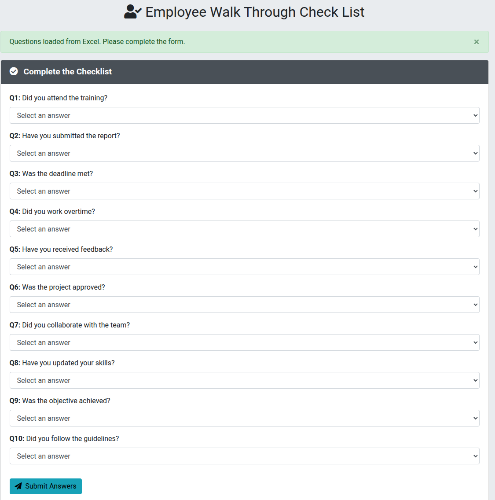

# ✅ Walk Through Check List System


> 📋 A comprehensive checklist management system for tracking employee compliance and progress through periodic assessments with admin oversight capabilities.

## 🎯 Overview

Enterprise checklist system designed for periodic employee assessments and compliance tracking. Features dual interfaces for employees and administrators with automated progress monitoring and comprehensive reporting capabilities.

## 📸 Application Preview

### Admin Dashboard

*Administrative interface for creating questionnaires and viewing employee responses*

### Employee Form

*User-friendly form interface with Yes/No dropdown answers for questionnaire completion*

## ✨ Core Features

- 📅 **Periodic Tracking** - Year and quarter-based questionnaire cycles
- 👤 **Employee Interface** - Simple form-based questionnaire completion with Yes/No answers
- 🔧 **Admin Dashboard** - Comprehensive management and reporting tools
- 📊 **Progress Monitoring** - Automatic completion status tracking
- 🔐 **Access Control** - Role-based interface separation
- 📱 **Responsive Design** - Mobile-friendly Bootstrap interface
- 📋 **Excel Integration** - Offline functionality with Excel file support

## 🚀 SharePoint Integration

Integrated with SharePoint REST API using 'logs' and 'Checklists' lists for employee data management, question configuration, and response tracking with digest authentication and real-time synchronization.

## 🛠️ Technical Stack

**Frontend Technologies:**
- HTML5, CSS3, JavaScript (ES6+)
- Bootstrap 4.1.3, Font Awesome 5
- jQuery 3.3.1, DataTables
- SheetJS (Excel file processing)

**Backend Integration:**
- SharePoint REST API
- Excel file integration (.xlsx)
- Real-time data validation
- Digest-based authentication

**Key Capabilities:**
- Dynamic form generation
- Period-based data filtering
- Automated status checking
- Comprehensive data visualization

## 📁 Project Structure

```
📦 project-05-WalkThroughCheckList/
├── 🏠 Form.html            # Employee questionnaire interface
├── 🛠️ Admin.html           # Admin dashboard
├── 📁 scripts/             # JavaScript modules
│   ├── excel-reader.js     # Excel file processing
│   ├── admin-dashboard.js  # Admin functionality
│   └── employee-form.js    # Form handling
├── 🖼️ img/                 # Application screenshots
│   ├── admin-dashboard.png # Admin interface preview
│   └── employee-form.png   # Form interface preview
├── 📊 DATA.xlsx            # Excel file for offline mode
├── 📋 README.md           # Documentation
└── 🚀 start-server.sh     # Local server script
```

---

<!-- Development Timeline: Project completed Dec 2024 -->

<div align="center">

**Employee Compliance Management Platform**

*Built for streamlined checklist workflows and administrative oversight*

</div>